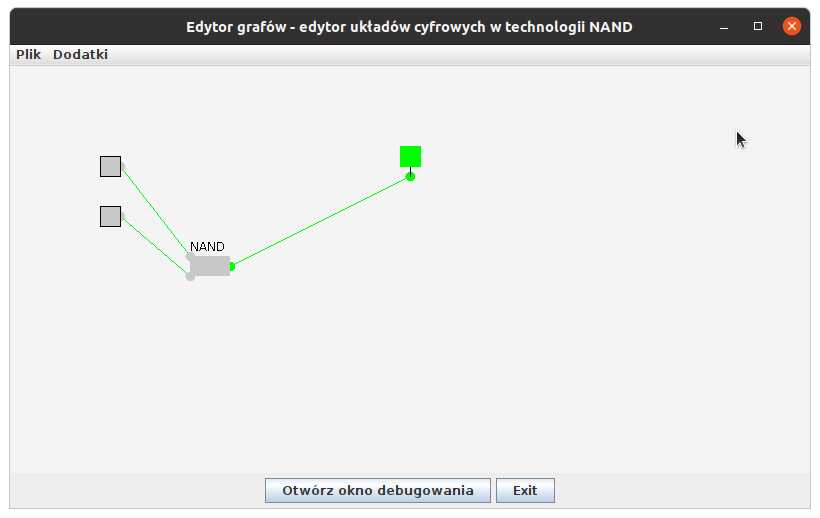
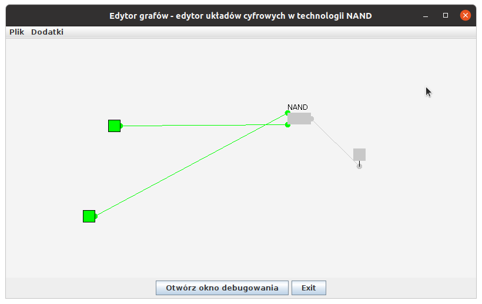
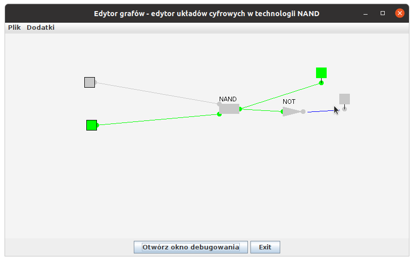
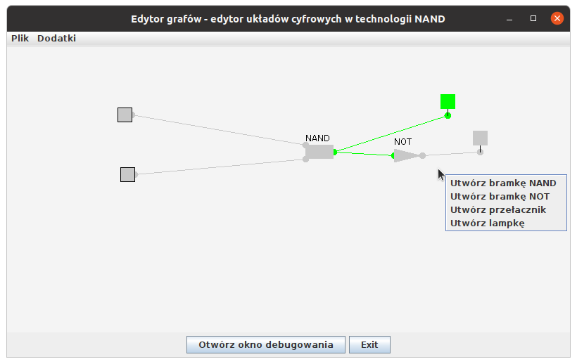

## Overview

The electronic circuit simulator is one of my very first applications. The idea is to create software that simulates electronic circuits based on the NAND logic. Once the application is run, the following screen can be visible:

Objects on the screen are movable by a mouse. Additionally, if the circuit grows, it is possible to move a whole board. Switches on the left-hand side are togglable. After their state changes, the whole circuit recalculates. 


You can create a new gate (NAND or NOT) and connect outputs and inputs by moving the mouse and holding the left button. While the edge is designed, it is blue. 



Select and insert a new gate by pressing the right mouse button (the context menu will open).



## Build & Run
compile into the `bin` directory
```
javac -d bin $(find src -name '*.java')
```
pack .jar file
```
cd bin
jar cfm output.jar ../src/Manifest.txt *
```
run
```
java -jar output.jar
```


